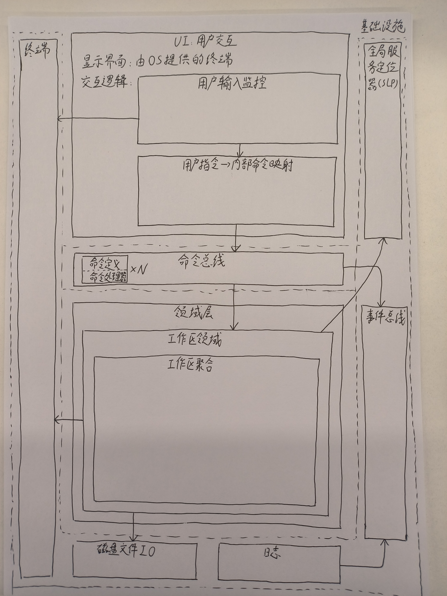
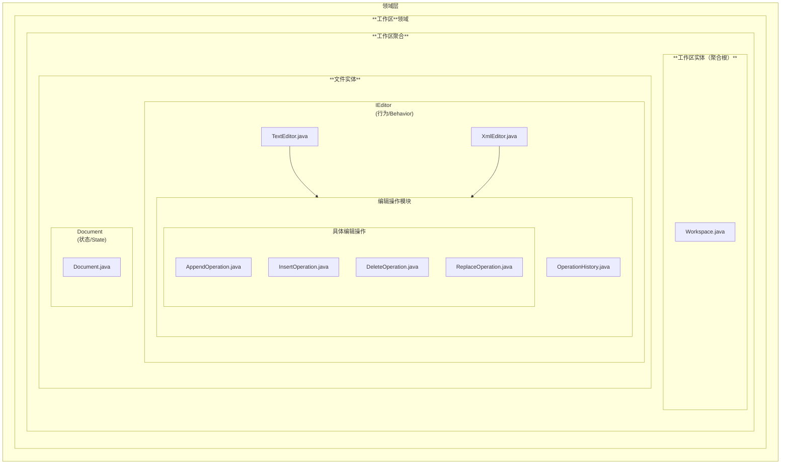
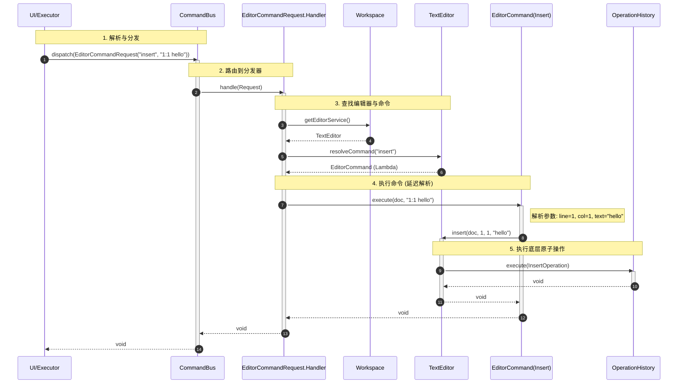

# 文本编辑器项目架构文档

## 1. 项目架构图

## 2. 领域层内部设计

```mermaid
graph TB
    subgraph Domain["领域层"]
        direction TB
        
        subgraph Workspace["**工作区**领域"]
            direction TB
            subgraph WorkspaceAggregate["**工作区聚合**"]
                direction TB

                subgraph WorkspaceEntity["**工作区实体（聚合根）**"]
                    direction TB
                    WorkspaceClass["Workspace.java<br/>"]
                end

                subgraph DocumentEntity["**文件实体**"]
                    direction TB
                    
                    subgraph IEditor["IEditor<br/> (行为/Behavior)"]
                        direction TB
                        TextEditor["TextEditor.java<br/>"]
                        XmlEditor["XmlEditor.java<br/>"]
                        
                        subgraph EditOperationModule["编辑操作模块"]
                            direction TB
                            OperationHistory["OperationHistory.java<br/>"]

                            subgraph EditOperations["具体编辑操作"]
                                direction TB
                                AppendOperation["AppendOperation.java<br/>"]
                                InsertOperation["InsertOperation.java<br/>"]
                                DeleteOperation["DeleteOperation.java<br/>"]
                                ReplaceOperation["ReplaceOperation.java<br/>"]
                            end
                        end

                        TextEditor --> EditOperationModule
                        XmlEditor --> EditOperationModule
                    end
                    subgraph Document["Document<br/>(状态/State)"]
                        direction TB
                        DocumentClass["Document.java<br/>"]
                    end
                end
            end
        end
    end
```
## 3. 命令执行流程图 (以 Insert 为例)

```mermaid
sequenceDiagram
    autonumber
    participant UI as UI/Executor
    participant Bus as CommandBus
    participant Dispatcher as EditorCommandRequest.Handler
    participant Manager as Workspace
    participant Editor as TextEditor
    participant Cmd as EditorCommand(Insert)
    participant History as OperationHistory

    Note over UI, Bus: 1. 解析与分发
    UI->>Bus: dispatch(EditorCommandRequest("insert", "1:1 hello"))
    activate Bus
    
    Note over Bus, Dispatcher: 2. 路由到分发器
    Bus->>Dispatcher: handle(Request)
    activate Dispatcher
    
    Note over Dispatcher, Editor: 3. 查找编辑器与命令
    Dispatcher->>Manager: getEditorService()
    Manager-->>Dispatcher: TextEditor
    
    Dispatcher->>Editor: resolveCommand("insert")
    Editor-->>Dispatcher: EditorCommand (Lambda)
    
    Note over Dispatcher, Cmd: 4. 执行命令 (延迟解析)
    Dispatcher->>Cmd: execute(doc, "1:1 hello")
    activate Cmd
    
    Note right of Cmd: 解析参数: line=1, col=1, text="hello"
    Cmd->>Editor: insert(doc, 1, 1, "hello")
    activate Editor
    
    Note over Editor, History: 5. 执行底层原子操作
    Editor->>History: execute(InsertOperation)
    activate History
    History-->>Editor: void
    deactivate History
    
    Editor-->>Cmd: void
    deactivate Editor
    
    Cmd-->>Dispatcher: void
    deactivate Cmd
    
    Dispatcher-->>Bus: void
    deactivate Dispatcher

    Bus-->>UI: void
    deactivate Bus
```